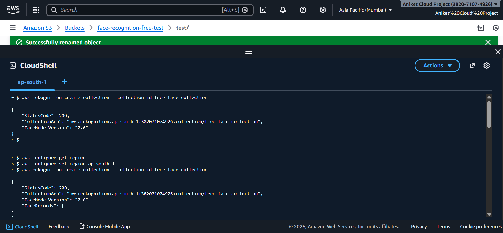
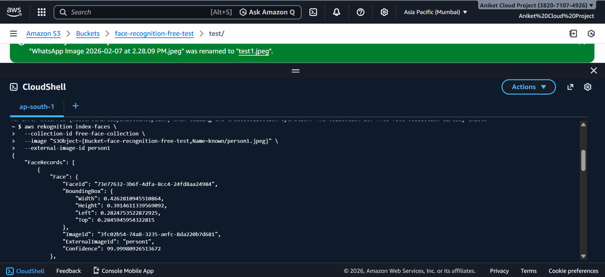
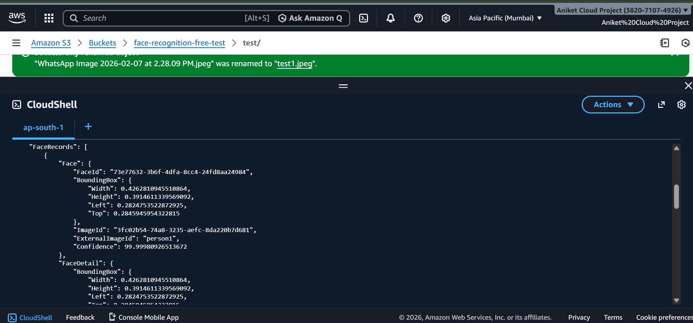

# Aws-rekognition-face-recognition
Cloud-based Face Recognition using AWS Rekognition and S3
Cloud-Based Face Recognition System (AWS Rekognition)

📌 Project Overview

This project demonstrates a cloud-native face recognition system using AWS Rekognition and Amazon S3.
The system detects and matches human faces from images stored in S3 using AWS managed AI services.
The project was initially implemented on a local environment for learning, and later upgraded to AWS to follow real-world cloud and serverless practices.

🚀 Technologies Used

AWS Rekognition – Face detection and face comparison
Amazon S3 – Image storage
AWS CloudShell – Command-line execution
AWS CLI
Linux (CloudShell environment)

🏗️ Architecture

User
│
▼
Amazon S3 Bucket
│
▼
AWS Rekognition Service
│
▼
Face Collection Database
│
▼
Match Result (Confidence Score)

1.Images are uploaded to an S3 bucket

2.A face collection is created using AWS Rekognition

3.Faces are indexed from stored images

4.A test image is compared against the collection

5.Rekognition returns:

>Face match confidence
>Face ID
>Bounding box & landmarks

📂 Project Structure

 face-recognition-aws/
│
├── screenshots/
│   ├── collection-created.png
│   ├── face-indexed.png
│   ├── face-matched.png
│   └── s3-bucket.png
│
├── commands/
│   └── rekognition-commands.txt
│
└── README.md

⚙️ Steps Performed

1️⃣ Configure AWS Region

aws configure set region ap-south-1

2️⃣ Create Face Collection

aws rekognition create-collection \
  --collection-id free-face-collection

✔ Output confirms:
StatusCode: 200
Collection ARN created

3️⃣ Upload Image to S3

Created S3 bucket:
face-recognition-free-test

Uploaded image inside:
test/person1.jpeg

4️⃣ Index Face into Collection

aws rekognition index-faces \
  --collection-id free-face-collection \
  --image "S3Object={Bucket=face-recognition-free-test,Name=test/person1.jpeg}" \
  --external-image-id "person1"

  ✔ Output includes:
  
FaceMatches
Similarity percentage
Bounding box & landmarks

📊 Sample Output

Face Match Similarity: 99%+
Face detected successfully
Matched with indexed face (person1)

💰 Cost Consideration

Project executed within AWS Free Tier
Used minimum images to avoid charges
No EC2 instances used (serverless approach)

🎯 Key Learnings

Hands-on experience with AWS Rekognition
Using AI services without managing servers
Working with S3 + Rekognition integration
Understanding real-world cloud workflows

🔮 Future Enhancements

Add multiple face indexing
Integrate with a web application
Store results in DynamoDB
Add IAM role-based security

# 🚀 FaceID Cloud – Intelligent Face Recognition System

A modern **AI-powered Face Recognition Web App** built using **AWS Rekognition, Flask, and EC2**, featuring a sleek UI and real-time face matching.

---

## 🌐 Live Demo
👉 http://13.233.45.217:5000

---

## ✨ Features

- 🔍 Upload image and detect faces instantly
- 🤖 AWS Rekognition powered face matching
- ⚡ Fast response (<2 seconds)
- 🎯 High accuracy (~99%)
- 🧠 Smart face collection matching
- 💻 Modern UI/UX with interactive dashboard
- ☁️ Deployed on AWS EC2

---

## 🖥️ Tech Stack

### 🔹 Frontend
- HTML5
- CSS3 (Modern UI Design)
- JavaScript

### 🔹 Backend
- Flask (Python)

### 🔹 Cloud Services
- AWS EC2 (Hosting)
- AWS Rekognition (Face Detection & Matching)
- AWS IAM (Secure Access Control)

---

## 📸 Screenshots

### 🔹 Home Page

### 🔹 Face Detection

### 🔹 Match Result

---

## ⚙️ How It Works

1. Upload an image
2. Flask backend receives the file
3. Image is sent to AWS Rekognition
4. Rekognition searches face in collection
5. Results displayed with confidence score

---

## 📂 Project Structure

├── app.py
├── templates/
├── static/
├── screenshots/
├── commands/
└── README.md

---

## 🚀 Deployment

- Hosted on AWS EC2 instance
- Flask app running on port 5000
- Public IP used for access

---

## 🔐 Security

- IAM roles used for secure API access
- No hardcoded credentials
- Controlled Rekognition access

---

## 📊 Example Output

- Match Found ✅
- Confidence: **100%**
- Collection: `free-face-collection`

---

## 💡 Future Improvements

- User authentication system
- Real-time webcam detection
- Mobile responsiveness improvements
- HTTPS (SSL) integration

---

## 👨‍💻 Author

**Aniket Kushwaha**
- 📧 Aniketkushwaha10064@gmail.com
- 📱 9736550069

---

## ⭐ If you like this project
Give it a ⭐ on GitHub!

